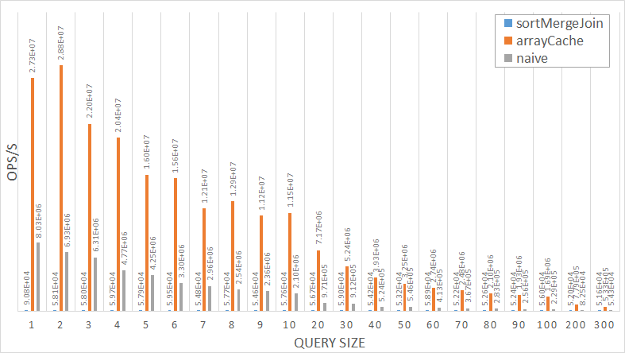

# SimpleDatabaseBenchmark

This codebase is designed to profile three possible ways of doing bulk lookup in BetterQuesting 3's SimpleDatabase.
Profiler output has shown this method to be a performance hotspot, especially on larger mod packs with several thousand
of quests.
In a mod pack with ~3000 quests and a server with 8 online players, this will result in 3000 * 3000 * 8 times of full iteration
through the quest database due to the `isUnlocked` calls in `QuestCache`.
There are other spots that will call `bulkLookup` a lot of times but the aforementioned issue is the most prominent one.

While reducing the call to `bulkLookup` can increase the performance as well, this will often require consider amount of
refactoring to every single piece of code.
To reduce the work required optimizing `bulkLookup` is preferred.

## Building

This project use [JMH](https://github.com/openjdk/jmh) and therefore use maven to build. 
Install maven and run `mvn clean package`.

## Running

Running with custom driver. If result_file_path is not specified it will not produce a result file.
```bash
java -cp target/benchmarks.jar net.glease.SimpleDatabaseBenchmark <result_file_path>
```

Running with standard JMH driver. 
The test name is `SimpleDatabaseBenchmark`. 
Replace `<args>` with `-h` to see list of possible argument.

```bash
java -jar target/benchmarks.jar <args>
```

## Precautions

The benchmark assumes a database of size 3000, and the query element is evenly distributed throughout the database.
This query distribution is to mimic the real world scenario where the query key is semi-random.
If random query key is used in benchmark then we cannot get a consistent result for sortMergeJoin test since that
one will eagerly stop walking through the database if all elements queried are found. 

## Conclusion

[](./result/result.txt)

Click to see raw data in csv format.

So an array cache is always superior, but this method can potentially use too much memory if the keys are too sparse.
Otherwise, a naive lookup wins when query size is < 500.
Sort merge join wins when query size is > 600.

That said, this test is not quite fair to sort merge join.
If the query is just the first X elements, sort merge join will be as fast as array look up (or even faster due to CPU cache).
The last element in the query I used in the benchmark is very close to the biggest key in the database, i.e. it will
almost always iterate through the entire database whereas in real world scenario that might not be the case. 
If the query element is picked randomly, the above conclusion applies.

